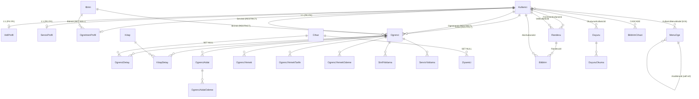

# OgrenciBilgiSistemi — Model & Mimari Analiz Raporu

> Tarih: 2026-06-17  
> Kapsam: 7 proje · 28 entity · 46 MVC ViewModel · 16 API DTO · 28 Mobil Model  
> Amaç: Clean Architecture geçiş yol haritasına (Faz 1+) girdi sağlamak

---

## 1. Entity Kataloğu

### 1.1 Kullanıcı & Organizasyon

| Entity | Amaç | PK | FK'lar (OnDelete) | Navigation Props | Global Filter | Soft Delete | Unique / Index |
|---|---|---|---|---|---|---|---|
| `KullaniciModel` | Sistem kullanıcısı (tüm roller) | `KullaniciId` int | — | VeliProfil¹, ServisProfil¹, OgretmenProfil¹, Ogrenciler (Veli), Ogrenciler (Ogretmen), Ziyaretciler, SinifYoklamalar, ServisYoklamalar, KullaniciMenuler | — | Hayır | `KullaniciAdi` UNIQUE; `Rol` IDX; `Telefon` IDX (non-empty) |
| `VeliProfilModel` | Veli profili (1:1 Kullanici) | `KullaniciId` int (FK=PK) | KullaniciId → Kullanici (CASCADE) | Kullanici | — | Hayır | PK = KullaniciId |
| `ServisProfilModel` | Servis/şoför profili | `KullaniciId` int (FK=PK) | KullaniciId → Kullanici (CASCADE) | Kullanici | — | Hayır | PK = KullaniciId |
| `OgretmenProfilModel` | Öğretmen profili | `KullaniciId` int (FK=PK) | KullaniciId → Kullanici (CASCADE); BirimId → Birim (SET NULL) | Kullanici, Birim | — | Hayır | PK = KullaniciId |
| `BirimModel` | Sınıf / birim | `BirimId` int | — | Ogrenciler | — | Hayır | — |

### 1.2 Öğrenci & Giriş-Çıkış

| Entity | Amaç | PK | FK'lar (OnDelete) | Navigation Props | Global Filter | Soft Delete | Unique / Index |
|---|---|---|---|---|---|---|---|
| `OgrenciModel` | Öğrenci | `OgrenciId` int | VeliId→Kullanici (RESTRICT); OgretmenId→Kullanici (RESTRICT); BirimId→Birim (RESTRICT); ServisId→Kullanici (RESTRICT) | Veli, Ogretmen, Birim, ServisKullanici, OgrenciDetaylar, OgrenciYemekler, OgrenciAidatlar, SinifYoklamalar, ServisYoklamalar | `OgrenciDurum \|\| IncludePasif` | Hayır | `OgrenciNo` UNIQUE; `OgrenciKartNo` UNIQUE (null/empty hariç) |
| `OgrenciDetayModel` | Kart okuma / giriş-çıkış kaydı | `OgrenciDetayId` int | OgrenciId→Ogrenci (RESTRICT); CihazId→Cihaz (RESTRICT) | Ogrenci, Cihaz | `Ogrenci.OgrenciDurum \|\| IncludePasif` | Hayır | (OgrenciId, IstasyonTipi) IDX; OgrenciGTarih IDX; OgrenciCTarih IDX |
| `CihazModel` | Kart okuyucu cihazı (ZKTeco / USB / QR) | `CihazId` int | — | OgrenciDetaylar, Ziyaretciler | — | Hayır | `CihazAdi` UNIQUE; `CihazKodu` UNIQUE; `IstasyonTipi` IDX |

### 1.3 Kütüphane

| Entity | Amaç | PK | FK'lar (OnDelete) | Navigation Props | Global Filter | Soft Delete | Unique / Index |
|---|---|---|---|---|---|---|---|
| `KitapModel` | Kitap tanımı | `KitapId` int | — | — | — | Hayır | — |
| `KitapDetayModel` | Kitap ödünç kaydı | `KitapDetayId` int | KitapId→Kitap (RESTRICT); OgrenciId→Ogrenci (RESTRICT) | Kitap, Ogrenci | `Ogrenci.OgrenciDurum \|\| IncludePasif` | Hayır | — |

### 1.4 Menü & Yetki

| Entity | Amaç | PK | FK'lar (OnDelete) | Navigation Props | Global Filter | Soft Delete | Unique / Index |
|---|---|---|---|---|---|---|---|
| `MenuOgeModel` | Menü ağacı (self-ref) | `Id` int | AnaMenuId→MenuOge (RESTRICT) | AnaMenu, AltMenuler, KullaniciMenuler | — | Hayır | (AnaMenuId, Sirala) IDX; Seed: Id 1-34 |
| `KullaniciMenuModel` | Kullanici ↔ Menü N:N köprüsü | (KullaniciId, MenuOgeId) composite | KullaniciId→Kullanici (CASCADE); MenuOgeId→MenuOge (CASCADE) | Kullanici, MenuOge | — | Hayır | Composite PK |

### 1.5 Aidat

| Entity | Amaç | PK | FK'lar (OnDelete) | Navigation Props | Global Filter | Soft Delete | Unique / Index |
|---|---|---|---|---|---|---|---|
| `OgrenciAidatModel` | Yıllık aidat kaydı | `OgrenciAidatId` int | OgrenciId→Ogrenci (RESTRICT) | Ogrenci, Odemeler | `Ogrenci.OgrenciDurum \|\| IncludePasif` | Hayır | (OgrenciId, BaslangicYil) UNIQUE; CHECK: yıl 2000-2100, tutarlar ≥ 0 |
| `OgrenciAidatTarifeModel` | Yıllık ücret tarifesi | `OgrenciAidatTarifeId` int | — | — | — | Hayır | `BaslangicYil` UNIQUE; CHECK: yıl 2000-2100, Tutar ≥ 0 |
| `OgrenciAidatOdemeModel` | Tekil ödeme kaydı | `OgrenciAidatOdemeId` int | OgrenciAidatId→OgrenciAidat (RESTRICT) | OgrenciAidat | `AktifMi && (Ogrenci.Durum \|\| IncludePasif)` | Hayır | (OgrenciAidatId, OdemeTarihi) IDX; CHECK: Tutar ≥ 0 |

### 1.6 Yemekhane

| Entity | Amaç | PK | FK'lar (OnDelete) | Navigation Props | Global Filter | Soft Delete | Unique / Index |
|---|---|---|---|---|---|---|---|
| `OgrenciYemekModel` | Aylık yemek kayıt | `Id` int | OgrenciId→Ogrenci (RESTRICT) | Ogrenci | `Ogrenci.OgrenciDurum \|\| IncludePasif` | Hayır | (OgrenciId, Yil, Ay) UNIQUE |
| `OgrenciYemekTarifeModel` | Öğrenci bazlı yıllık yemek tarifesi | `Id` int | OgrenciId→Ogrenci (RESTRICT) | Ogrenci | `Ogrenci.OgrenciDurum \|\| IncludePasif` | Hayır | (OgrenciId, Yil) UNIQUE |
| `OgrenciYemekOdemeModel` | Yemek ödemesi | `OgrenciYemekOdemeId` int | OgrenciId→Ogrenci (RESTRICT) | Ogrenci | `AktifMi && (Ogrenci.Durum \|\| IncludePasif)` | Hayır | (OgrenciId, Yil, Ay) IDX |

### 1.7 Yoklama

| Entity | Amaç | PK | FK'lar (OnDelete) | Navigation Props | Global Filter | Soft Delete | Unique / Index |
|---|---|---|---|---|---|---|---|
| `SinifYoklamaModel` | Günlük ders yoklaması (8 ders) | `SinifYoklamaId` int | OgrenciId→Ogrenci (RESTRICT); KullaniciId→Kullanici (RESTRICT) | Ogrenci, Kullanici | `Ogrenci.OgrenciDurum \|\| IncludePasif` | Hayır | (OgrenciId, OlusturulmaTarihi) IDX |
| `ServisYoklamaModel` | Servis bindi/binmedi kaydı | `ServisYoklamaId` int | OgrenciId→Ogrenci (RESTRICT); KullaniciId→Kullanici (RESTRICT) | Ogrenci, Kullanici | `Ogrenci.OgrenciDurum \|\| IncludePasif` | Hayır | (KullaniciId, OgrenciId, Periyot, OlusturulmaTarihi) IDX |

### 1.8 Ziyaretçi & Randevu

| Entity | Amaç | PK | FK'lar (OnDelete) | Navigation Props | Global Filter | Soft Delete | Unique / Index |
|---|---|---|---|---|---|---|---|
| `ZiyaretciModel` | Okul ziyaretçisi (kart okuma) | `ZiyaretciId` int | KullaniciId→Kullanici (SET NULL); CihazId→Cihaz (SET NULL) | Kullanici, Cihaz | — | Hayır | — |
| `RandevuModel` | Veli-öğretmen randevusu | `RandevuId` int | OgretmenKullaniciId→Kullanici (RESTRICT); VeliKullaniciId→Kullanici (RESTRICT); OgrenciId→Ogrenci (RESTRICT) | Ogretmen, Veli, Ogrenci | `!IsDeleted` | **Evet** | (RandevuTarihi) IDX; (OgretmenKullaniciId, RandevuTarihi) FILTERED IDX (IsDeleted=0) |
| `OgretmenRandevuModel` | Öğretmen uygunluk slotu | `OgretmenRandevuId` int | OgretmenKullaniciId→Kullanici (RESTRICT) | Ogretmen | `!IsDeleted` | **Evet** | (OgretmenKullaniciId, Tarih, BaslangicSaati) UNIQUE (IsDeleted=0) |

### 1.9 Bildirim & Duyuru

| Entity | Amaç | PK | FK'lar (OnDelete) | Navigation Props | Global Filter | Soft Delete | Unique / Index |
|---|---|---|---|---|---|---|---|
| `BildirimModel` | Uygulama içi bildirim | `BildirimId` int | AliciKullaniciId→Kullanici (RESTRICT); RandevuId→Randevu (RESTRICT) | Alici, Randevu | `!IsDeleted` | **Evet** | (AliciKullaniciId, Okundu) IDX |
| `DuyuruModel` | Öğretmen/yönetici duyurusu | `DuyuruId` int | OlusturanKullaniciId→Kullanici (RESTRICT) | Olusturan | `!IsDeleted` | **Evet** | (OlusturulmaTarihi) IDX; (OlusturanKullaniciId) IDX |
| `DuyuruOkumaModel` | Duyuru okundu izi | `DuyuruOkumaId` int | DuyuruId→Duyuru (RESTRICT); KullaniciId→Kullanici (RESTRICT) | Duyuru, Kullanici | `!Duyuru.IsDeleted` | Hayır (dolaylı) | (DuyuruId, KullaniciId) UNIQUE; (KullaniciId) IDX |

### 1.10 SMS & Push

| Entity | Amaç | PK | FK'lar (OnDelete) | Navigation Props | Global Filter | Soft Delete | Unique / Index |
|---|---|---|---|---|---|---|---|
| `SmsGonderimGecmisiModel` | SMS gönderim logu | `SmsGonderimGecmisiId` int | OgrenciId→Ogrenci (SET NULL) | Ogrenci | — | Hayır | (OgrenciId, GonderimZamani) IDX; (Tip, GonderimZamani) IDX |
| `BildirimCihaziModel` | FCM token kaydı | `BildirimCihaziId` int | KullaniciId→Kullanici (CASCADE) | Kullanici | — | **Evet** | `FcmToken` UNIQUE (IsDeleted=0); (KullaniciId, IsDeleted) IDX |

---

## 2. İlişki Haritası

### 2.1 İlişki Türleri

**1:1 (Profil Tabloları)**
- `Kullanici` → `VeliProfil` (PK=FK, CASCADE)
- `Kullanici` → `ServisProfil` (PK=FK, CASCADE)
- `Kullanici` → `OgretmenProfil` (PK=FK, CASCADE)

**1:N (Ana ilişkiler)**
- `Kullanici` → `Ogrenci` (hem VeliId hem OgretmenId ve ServisId üzerinden, RESTRICT)
- `Birim` → `Ogrenci` (RESTRICT), `OgretmenProfil` (SET NULL)
- `Ogrenci` → `OgrenciDetay`, `KitapDetay`, `OgrenciAidat`, `OgrenciYemek`, `OgrenciYemekTarife`, `OgrenciYemekOdeme`, `SinifYoklama`, `ServisYoklama`, `SmsGonderimGecmisi`
- `OgrenciAidat` → `OgrenciAidatOdeme`
- `Kullanici` → `Randevu` (OgretmenKullaniciId ve VeliKullaniciId üzerinden, RESTRICT)
- `Kullanici` → `OgretmenRandevu`, `Bildirim`, `Duyuru`, `BildirimCihazi`, `Ziyaretci`
- `Randevu` → `Bildirim` (RESTRICT)
- `Duyuru` → `DuyuruOkuma`
- `Cihaz` → `OgrenciDetay`, `Ziyaretci` (SET NULL)
- `Kitap` → `KitapDetay`

**N:N**
- `Kullanici` ↔ `MenuOge` via `KullaniciMenuModel` (her iki yönde CASCADE)

**Self-Reference**
- `MenuOge` → `MenuOge` (AnaMenuId, RESTRICT): üst-alt menü hiyerarşisi

### 2.2 OnDelete Davranış Özeti

| Davranış | Nerelerde |
|---|---|
| **RESTRICT** | Çoğunluk FK (veri silme engeli — uygulama katmanında kontrol zorunlu) |
| **CASCADE** | Profil tabloları (Kullanici silinince profili de silinir); KullaniciMenuModel (bridge) |
| **SET NULL** | OgretmenProfil.BirimId; ZiyaretciModel.KullaniciId, CihazId; SmsGonderimGecmisi.OgrenciId; OgrenciDetay.CihazId |

### 2.3 Mermaid ER Diyagramı (Ana Varlıklar)



---

## 3. DTO ↔ Entity Eşleşmeleri

### 3a. MVC ViewModels (OgrenciBilgiSistemi/ViewModels/ — 46 dosya)

**Pattern 1 — FormVm (çift yönlü dönüşüm)**

| ViewModel | Entity | Dönüşüm Metotları | Eksik / Farklı Alanlar |
|---|---|---|---|
| `BirimFormVm` | `BirimModel` | `FromModel()` / `ToModel()` | FormAction, SubmitText (UI-only) |
| `KitapFormVm` | `KitapModel` | `FromModel()` / `ToModel()` | KitapGorselFile (not mapped) |
| `KitapDetayFormVm` | `KitapDetayModel` | `FromModel()` / `ToModel()` | Kitaplar, Ogrenciler (SelectList) |
| `CihazFormVm` | `CihazModel` | `FromModel()` / `ToModel()` + `IValidatableObject` | ShowGuid, GuidStr (UI helper) |
| `OgretmenFormVm` | `OgretmenProfilModel` + `KullaniciModel` | `FromModel()` / `ToProfilModel()` / `ToEkleVm()` | Sifre (input only, hash'lenmez burada) |
| `ServisFormVm` | `ServisProfilModel` + `KullaniciModel` | `FromModel()` / `ToProfilModel()` / `ToEkleVm()` | — |
| `VeliFormVm` | `VeliProfilModel` + `KullaniciModel` | `FromModel()` / `ToProfilModel()` / `ToEkleVm()` | — |
| `KullaniciFormVm` | `KullaniciModel` + 3 profil | `FromModel()` / `ToModel()` | Composite: rol bazlı alanlar koşullu |
| `OgretmenRandevuFormVm` | `OgretmenRandevuModel` | `FromModel()` / `ToModel()` | Ogretmenler (SelectList) |
| `DuyuruDetayVm` | `DuyuruModel` | `static FromModel()` | OlusturanAdi (nav prop flatten) |

**Pattern 2 — IndexVm (pagination wrapper)**

| ViewModel | İçerdiği Tip | Entity / DTO |
|---|---|---|
| `OgrenciListeVm` | `SayfalanmisListeModel<OgrenciModel>` | OgrenciModel doğrudan |
| `AidatRaporVm` | `SayfalanmisListeModel<AidatRaporDto>` | projection DTO |
| `YemekhaneIndexVm` | `SayfalanmisListeModel<YemekhaneIndexSatirDto>` | projection DTO |
| `OgrenciVeliRaporVm` | `SayfalanmisListeModel<OgrenciVeliRaporDto>` | projection DTO |
| `ZiyaretciRaporVm` | `List<ZiyaretciRaporDto>` | projection DTO |
| `RandevuListeVm` | `SayfalanmisListeModel<RandevuModel>` | entity doğrudan |

### 3b. API DTOs (OgrenciBilgiSistemi.Api/Dtos/ — 16 dosya)

**Input (İstek) DTOs**

| DTO | Bağlı Entity | Notlar |
|---|---|---|
| `GirisIstegiDto` | `KullaniciModel` | `OkulKodu` field var (MVC versiyonunda yok — **ad çakışması**) |
| `SifreDegistirIstegiDto` | `KullaniciModel` | Sadece `YeniSifre` |
| `TokenYenilemeIstegiDto` | — (record) | RefreshToken string |
| `OgrenciKaydetDto` | `OgrenciModel` | `OgrenciGorsel` base64 string (entity'de path) |
| `RandevuOlusturDto` | `RandevuModel` | `KarsiTarafKullaniciId` (veli ya da öğretmen) |
| `OgretmenRandevuEkleDto` | `OgretmenRandevuModel` | — |
| `DuyuruOlusturDto` | `DuyuruModel` | — |
| `TopluYoklamaGuncelleDto` | `SinifYoklamaModel` | `SinifId` + `DersNumarasi` + `List<YoklamaKayitOgesiDto>` |
| `ServisYoklamaKaydetDto` | `ServisYoklamaModel` | `Periyot` + `List<YoklamaKayitOgesiDto>` |
| `CihazKayitIstegiDto` | `BildirimCihaziModel` | — |
| `CihazSilIstegiDto` | `BildirimCihaziModel` | Sadece FcmToken |
| `CihazTokenYenileIstegiDto` | `BildirimCihaziModel` | EskiToken + YeniToken |
| `TestPushIstegiDto` | — | Push test (yönetici) |

**Output (Yanıt) DTOs**

| DTO | Bağlı Entity | Eksik / Gizlenen Alanlar |
|---|---|---|
| `OgrenciDetayDto` | `OgrenciModel` + `VeliProfilModel` + `OgretmenProfilModel` + `ServisProfilModel` | `VeliId`, `ServisId` alanları var ama mobil `OgrenciDetay` modelinde **yok** |
| `ServisYoklamaGecmisDto` | `ServisYoklamaModel` | OgrenciId, Periyot, DurumId, Tarih |

### 3c. Shared DTOs + Mobil Models

**Shared DTOs (OgrenciBilgiSistemi.Shared/Dtos/)**

| DTO | Kullanım Yeri | Entity |
|---|---|---|
| `GecisKayitDto` | API → Mobil | `OgrenciDetayModel` projection |
| `SinifYoklamaDto` | API → Mobil | `SinifYoklamaModel` mirror; `DersGetir(int)` metodu shared |

**Mobil Models (OgrenciBilgiSistemi.Mobil/Models/) — API mirror katmanı**

| Mobil Model | Karşılığı | Fark |
|---|---|---|
| `OgrenciDetay` | `OgrenciDetayDto` (API) | `VeliId`, `ServisId` eksik |
| `GecisKayit` | `GecisKayitDto` (Shared) | `[JsonPropertyName]` ile API field adları eşleniyor (`ogrenciGTarih` → `GirisTarihi`) |
| `SinifYoklama` | `SinifYoklamaDto` (Shared) | Birebir mirror + `DersGetir()` |
| `Duyuru` | `DuyuruModel` (MVC) | Mobil'e özel `TarihMetni` computed prop |
| `Bildirim` | `BildirimModel` (MVC) | Mobil'e özel `TarihMetni` computed prop |
| `Randevu` | `RandevuModel` (MVC) | Flatten: `OgretmenAdSoyad`, `VeliAdSoyad` navigation flatten |

### 3d. Tespit Edilen Tutarsızlıklar

| # | Tutarsızlık | Konum | Risk |
|---|---|---|---|
| T1 | `GirisIstegiDto` — MVC'de `Okullar (List<OkulBilgiAyari>)`, API'de `OkulKodu (string)` — aynı ad, farklı contract | MVC/Dtos vs Api/Dtos | Yüksek — refactor sırasında karışıklık |
| T2 | `OgrenciDetayDto.VeliId` ve `ServisId` var, `Mobil/Models/OgrenciDetay` modelinde yok | Api/Dtos vs Mobil/Models | Orta — mobil bu alanları kullanamıyor |
| T3 | `OgrenciYemekTarifeModel` öğrenci bazlı (OgrenciId FK), ancak `OgrenciAidatTarifeModel` global (OgrenciId yok) — iki farklı tarife modeli | MVC/Models | Orta — raporlama mantığı karışık |
| T4 | `RandevuListeVm` entity'yi doğrudan `RandevuModel` olarak taşıyor (DTO yok) | MVC/ViewModels | Düşük — katman sızıntısı |
| T5 | `OgrenciListeVm` entity'yi doğrudan `OgrenciModel` olarak taşıyor | MVC/ViewModels | Düşük — katman sızıntısı |

---

## 4. Clean Architecture Analizi

### 4.1 Mevcut Katman Haritası

```
┌─────────────────────────────────────────────────────────────┐
│  Presentation                                               │
│  MVC Controllers+Views │ API Controllers │ Mobil Pages+VM  │
├─────────────────────────────────────────────────────────────┤
│  Application (Service katmanı)                              │
│  MVC: 25+ *Service (interface'li)                           │
│  API: 17 *Service (interface'siz ❌)                        │
│  Mobil: 14 HTTP Service (Singleton)                         │
├─────────────────────────────────────────────────────────────┤
│  Infrastructure                                             │
│  MVC: AppDbContext (EF Core)   │ API: Raw SqlClient         │
│  Sms (ilksms.com HttpClient)   │ Push (FCM)                 │
│  ZKTeco COM (Singleton)        │ LocalFileStorage           │
├─────────────────────────────────────────────────────────────┤
│  Domain ← MEVCUT DURUMDA YOK (ayrı proje olarak)           │
│  Entity'ler MVC projesinin Models/ klasöründe               │
│  Enum'lar Shared projesinde                                 │
└─────────────────────────────────────────────────────────────┘
```

### 4.2 Bağımlılık Grafiği (Mevcut)

```
MVC (x86)  ──────────────────────────────► Shared
    │                                         ▲
    ├── AppDbContext (EF Core)                 │
    ├── 25+ Service (DbContext inject)         │
    ├── 5 BackgroundService                    │
    ├── ZKTecoService (Singleton COM)          │
    └── KartOkuHub (SignalR)                   │
                                               │
API (x86)  ──────────────────────────────► Shared
    │
    ├── 17 Service (raw SqlClient inject, interface yok)
    ├── 1 BackgroundService (SMS retry)
    └── RefreshTokenService (in-memory Singleton)

Mobil  ───────────────────────────────────► Shared
    └── 14 Service (HTTP → API)

Sms ◄──── MVC & API (bağımsız, ilksms.com)
Push ◄─── MVC & API (bağımsız, FCM)
```

### 4.3 Tespit Edilen Clean Architecture İhlalleri

| # | İhlal | Açıklama | Ağırlık |
|---|---|---|---|
| CA1 | **Entity'ler Presentation projesinde** | `OgrenciBilgiSistemi/Models/` → MVC projesinin içinde. Domain katmanı ayrı proje değil. | Yüksek |
| CA2 | **API servislerinde interface yok** | 17 API servisi doğrudan somut sınıf; DI container'a kayıtlı ama test edilemez, mock'lanamaz. | Yüksek |
| CA3 | **Repository/Unit of Work yok** | 25+ MVC servisi doğrudan `AppDbContext` inject alıyor. Veri erişim mantığı servis katmanıyla iç içe. | Yüksek |
| CA4 | **TenantBaglami her serviste tekrar** | Tüm servisler `TenantBaglami` bağımlılığı taşıyor (connection string için). Repository pattern bunu gizleyebilirdi. | Orta |
| CA5 | **Domain validation DB'de** | Check constraint'ler SQL'de, domain model'de değil. Uygulama dışında doğrulama yok. | Orta |
| CA6 | **BackgroundService'ler DB'ye doğrudan müdahale** | Hosted service'ler kendi `IServiceScope` açarak DbContext/SqlClient kullanıyor. | Orta |
| CA7 | **Mobil Models = API response mirror** | `Mobil/Models/` kendi entity katmanı gibi görünüyor ama aslında deserialize şablonu. Ayrı bir Shared API contract paketi yok. | Orta |

### 4.4 Doğru Katmanda Olan Yapılar

- `Shared` projesi: Enums, TenantBaglami, OkulYapilandirmaServisi → **doğru yerde**
- `Sms` projesi: Bağımsız, arayüzü `ISmsGonderici` → **doğru yerde**
- `Push` projesi: Bağımsız, arayüzü `IPushBildirimGonderici` → **doğru yerde**
- MVC service interface'leri (`I*Service`) → **doğru pattern**, API'de eksik
- `AppDbContext` global query filter'lar → **EF Core best practice uyumlu**

---

## 5. Riskler

| # | Risk | Kategori | Ağırlık | Etkilenen Yer |
|---|---|---|---|---|
| R1 | **N+1 Sorgu:** `OgrenciListeVm.YemekDurumMap` her öğrenci için ayrı sorgu çekiyor olabilir | Performans | Yüksek | MVC OgrenciController / OgrenciService |
| R2 | **Çift Cascade Delete:** `KullaniciMenuModel` hem Kullanici hem MenuOge üzerinden CASCADE — SQL Server bunu reddeder (multiple cascade paths) | Veri Bütünlüğü | Yüksek | AppDbContext Fluent API |
| R3 | **Soft Delete Çakışması:** `DuyuruOkumaModel` global filtresi `!Duyuru.IsDeleted`'a bağlı. Duyuru soft-delete olunca `DuyuruOkuma` kayıtları da gizlenir; okuma geçmişi kaybolur. | Veri Bütünlüğü | Yüksek | AppDbContext + DuyuruService |
| R4 | **API Servislerinde Interface Yok** | Test Edilemezlik | Yüksek | OgrenciBilgiSistemi.Api/Services/ |
| R5 | **GirisIstegiDto Ad Çakışması** — MVC ve API'de aynı ad, farklı property seti; using direktifleri veya refactor sırasında hata riski | Karışıklık | Yüksek | MVC/Dtos/GirisIstegiDto.cs, Api/Dtos/GirisIstegiDto.cs |
| R6 | **OgrenciKartNo Unique Index:** Null veya boş string durumu — boş string birden fazla öğrencide olabilir mi? (Filtre `IS NULL OR = ''`) | Veri Bütünlüğü | Orta | AppDbContext Fluent API |
| R7 | **OgrenciYemekTarifeModel per-student** — Tarife öğrenciye bağlı (OgrenciId FK), ama `OgrenciAidatTarifeModel` global. İki farklı tarife yaklaşımı; yemek raporlarında karışıklık. | Domain Netliği | Orta | OgrenciYemekTarifeModel, YemekhaneService |
| R8 | **KullaniciFormVm Composite Yapısı** — Ogretmen + Servis + Veli rollerini tek form'da yönetiyor. SRP ihlali; yeni rol eklenince büyüyecek. | Bakım | Orta | MVC/ViewModels/KullaniciFormVm |
| R9 | **Mobil Models API'den bağımsız** — API DTO değişince mobil model manuel güncellenmeli. `GecisKayitDto` ve `SinifYoklamaDto` Shared'da ama diğerleri yok. | Kırılganlık | Orta | Mobil/Models/ |
| R10 | **FCM Token Birikimi:** `BildirimCihaziModel` soft-delete — unique index `IsDeleted=0` üzerinde. Eski soft-deleted token'lar DB'de kalır, birikir. | Veri Temizlik | Düşük | BildirimCihaziModel, Api/Services/RawSqlBildirimTokenDeposu |
| R11 | **Tehlikeli Cascade: Kullanici silinince VeliProfil, ServisProfil, OgretmenProfil** silinir. Bu profillere bağlı Ogrenci kayıtları varsa RESTRICT FK'ları bloklayacak. Temizlik sırası kritik. | Veri Bütünlüğü | Orta | KullaniciService, profil tabloları |
| R12 | **RandevuModel.OgrenciId RESTRICT** — Öğrenci silinemez eğer aktif randevusu varsa. Ancak soft-delete filter'a rağmen count kontrolü yapılmalı. | Veri Bütünlüğü | Düşük | RandevuService, OgrenciService |

---

## 6. Öneriler

### 6.1 Mimari Öneriler (Clean Architecture Geçişi)

**Öneri M1 — Domain Projesi Çıkart (CA1)**  
*Faz: Sonraki major milestone*

**Neden:** Entity'ler şu an MVC projesinin `Models/` klasöründe. API bu entity'lere ulaşmak için MVC'ye bağımlı hale geliyor — Clean Architecture'da Domain bağımsız bir proje olmalı.

**Adımlar:**

1. Yeni proje oluştur:
   ```bash
   dotnet new classlib -n OgrenciBilgiSistemi.Domain -f net10.0
   dotnet sln add OgrenciBilgiSistemi.Domain/OgrenciBilgiSistemi.Domain.csproj
   ```

2. Taşınacak 28 entity (`OgrenciBilgiSistemi/Models/` → `OgrenciBilgiSistemi.Domain/Entities/`):
   `KullaniciModel`, `VeliProfilModel`, `ServisProfilModel`, `OgretmenProfilModel`, `BirimModel`,
   `OgrenciModel`, `OgrenciDetayModel`, `CihazModel`, `KitapModel`, `KitapDetayModel`,
   `MenuOgeModel`, `KullaniciMenuModel`, `OgrenciAidatModel`, `OgrenciAidatTarifeModel`, `OgrenciAidatOdemeModel`,
   `OgrenciYemekModel`, `OgrenciYemekTarifeModel`, `OgrenciYemekOdemeModel`,
   `SinifYoklamaModel`, `ServisYoklamaModel`,
   `ZiyaretciModel`, `RandevuModel`, `OgretmenRandevuModel`,
   `BildirimModel`, `DuyuruModel`, `DuyuruOkumaModel`,
   `SmsGonderimGecmisiModel`, `BildirimCihaziModel`

3. Namespace değişimi (toplu rename):
   `OgrenciBilgiSistemi.Models` → `OgrenciBilgiSistemi.Domain.Entities`

4. Enum kararı: `Shared` enum'ları (`KullaniciRolu`, `OgrenciFiltre` vb.) yerinde kalır — Shared tüm projelerde referans alındığı için bağımlılık yönü korunur. Domain → Shared referansı eklenir.

5. `ProjectReference` değişiklikleri:
   ```xml
   <!-- OgrenciBilgiSistemi.Domain.csproj -->
   <ProjectReference Include="..\OgrenciBilgiSistemi.Shared\..." />

   <!-- MVC ve API .csproj -->
   <ProjectReference Include="..\OgrenciBilgiSistemi.Domain\..." />
   ```

6. Build sırası: `Domain` → `Shared` → `Sms` / `Push` → `MVC` / `API`

7. **Kritik:** `AppDbContext` ve tüm migration'lar entity'lere bağımlı — taşıma tek commit'te yapılmalı, build kırık bırakılmamalı.

**Doğrulama:** `dotnet build` tüm projeler için hatasız tamamlanmalı. VS'de `OgrenciBilgiSistemi.Models` namespace'ine referans kalmadığını `Grep` ile doğrula.

---

**Öneri M2 — API Servislerine Interface Ekle (CA2, R4)**  
*Faz: Faz 2 — controller'lar refactor edilirken kademeli ekle*

**Neden:** 16 API servisi somut sınıf olarak DI'ya kayıtlı. Mock/fake yapılamıyor → unit test yazılamıyor. MVC'de her servisin `I*Service` interface'i var; API'de yok.

**Adımlar:**

1. `OgrenciBilgiSistemi.Api/Services/Interfaces/` klasörü oluştur.

2. Her controller refactor edilirken ilgili servise interface ekle (kademeli):
   ```
   IBildirimService        IBirimService          IDuyuruService
   IGecisKayitService      IGirisService          IOgrenciService
   IOgretmenListeService   IOgretmenRandevuService IRandevuService
   IServisService          ISinifService          IVeliListeService
   IYoneticiService        IYoklamaSmsBildirimService
   ```
   - `RefreshTokenService` → Singleton; `IRefreshTokenService` opsiyonel (in-memory, test ortamında swap gerekirse ekle)
   - `RawSqlBildirimTokenDeposu` → zaten `IBildirimTokenDeposu` uygulayan var ✓
   - `BekleyenYoklamaSmsRetryService` → `BackgroundService` subclass, interface gerekmez

3. Interface içerik kuralı: **sadece controller'ların çağırdığı public method'lar** — servis-içi yardımcı method'lar interface'e girmez.

4. DI kaydı değişimi (`Program.cs`):
   ```csharp
   // Önce:
   services.AddScoped<OgrenciService>();
   // Sonra:
   services.AddScoped<IOgrenciService, OgrenciService>();
   ```

5. Controller constructor injection güncellenir: `OgrenciService` → `IOgrenciService`.

6. Test pattern (örnek):
   ```csharp
   var mockService = new Mock<IOgrenciService>();
   mockService.Setup(s => s.GetByIdAsync(1)).ReturnsAsync(fakeOgrenci);
   var controller = new OgrencilerController(mockService.Object);
   ```

**Doğrulama:** `dotnet build` hatasız. `OgrenciBilgiSistemi.Api.Tests` projesinde en az 1 controller unit testi somut sınıf yerine interface kullanmalı.

---

**Öneri M3 — Mobil API Contract Katmanı (CA7, R9)**  
*Faz: Faz 3*

**Neden:** API DTO'su değişince mobil modeli manuel güncellemek gerekiyor. `GecisKayitDto` ve `SinifYoklamaDto` zaten Shared'da — diğer response modelleri de oraya taşınmalı.

**Adımlar:**

1. `OgrenciBilgiSistemi.Shared/ApiContracts/` klasörü oluştur.

2. Taşınacak modeller (`Mobil/Models/` → `Shared/ApiContracts/`):

   | Mobil Model | Yeni Ad | Notlar |
   |---|---|---|
   | `OgrenciDetay.cs` | `OgrenciDetayDto.cs` | `VeliId`, `ServisId` zaten eklendi |
   | `Duyuru.cs` | `DuyuruDto.cs` | `TarihMetni` computed prop Mobil'de kalır |
   | `Bildirim.cs` | `BildirimDto.cs` | `TarihMetni` computed prop Mobil'de kalır |
   | `Randevu.cs` | `RandevuDto.cs` | `OgretmenAdSoyad`, `VeliAdSoyad` flatten |

   - `GecisKayitDto`, `SinifYoklamaDto` → zaten Shared'da, yerinde kalır ✓

3. API controller'ları ilgili servislerden `Shared.ApiContracts.*` DTO döndürmeye başlar.

4. Mobil `using` direktifleri:
   ```csharp
   // Önce:
   using OgrenciBilgiSistemi.Mobil.Models;
   // Sonra:
   using OgrenciBilgiSistemi.Shared.ApiContracts;
   ```

5. `[JsonPropertyName]` attribute'ları (şu an `GecisKayit`'te var) aynı pattern ile Shared DTO'larına taşınır.

6. Mobil'e özel computed property'ler (`TarihMetni` vb.) Mobil'de extension method veya wrapper class olarak kalır — Shared DTO'larına UI kodu girmez.

**Doğrulama:** `Mobil/Models/` içinde sadece Mobil'e özgü (UI state, computed prop) sınıflar kalmalı. API endpoint'ten dönen tüm response DTO'ları Shared'da olmalı. `dotnet build` tüm projeler hatasız.

### 6.2 Veri Bütünlüğü Önerileri

**Öneri V1 — Çift Cascade Delete Kontrolü (R2)** ✅ *Tamamlandı 2026-06-18*
```
KullaniciMenuModel:
- Kullanici tarafı: CASCADE bırak (kullanici silinince menü atamaları gitsin)
- MenuOge tarafı: CASCADE → RESTRICT değiştir (menü silinince atamaları önce kontrol et)
```
SQL Server `multiple cascade paths` hatasını engeller.  
*Değişiklik: `AppDbContext.cs` + migration `20260618000000_KullaniciMenuMenuOgeCascadeDuzelt` — DB'ye uygulandı.*

**Öneri V2 — DuyuruOkuma Filter Düzelt (R3)** ✅ *Tamamlandı 2026-06-18*
```csharp
// Mevcut (sorunlu):
builder.Entity<DuyuruOkumaModel>().HasQueryFilter(o => !o.Duyuru.IsDeleted);

// Düzeltme: DuyuruOkuma'yı filtreden çıkar, sadece Duyuru filtrele
// Okuma geçmişi her zaman görünür kalsın; Duyuru sorgulanınca filtre tetiklensin
builder.Entity<DuyuruOkumaModel>().HasQueryFilter(o => true);
```
*Migration gerekmez — query filter kod taraflı. `AppDbContext.cs` güncellendi.*

**Öneri V3 — OgrenciKartNo Boş String Kontrolü (R6)** ✅ *Tamamlandı 2026-06-18*
```csharp
// Düzeltme: Uygulama katmanında boş string → null normalize et
// MVC OgrenciService.cs: NormalizeKartNo() → null döndürür (önce "" döndürüyordu)
// API OgrenciService.cs: EkleAsync + GuncelleAsync — @kartNo parametresinden önce normalize
var kartNo = string.IsNullOrWhiteSpace(dto.OgrenciKartNo) ? null : dto.OgrenciKartNo.Trim();
```

### 6.3 Performans Önerileri

**Öneri P1 — N+1 Sorgu Düzelt (R1)** ✅ *Zaten çözülmüş*

`YemekhaneService.GetBuAyDurumlariAsync` tek `WHERE OgrenciId IN (...)` sorgusuyla dictionary döndürüyor.
`OgrencilerController.Index` bu metodu doğrudan çağırıyor — N+1 mevcut değil.
```csharp
// YemekhaneService.cs:166 — mevcut, doğru implementasyon:
var list = await _ctx.OgrenciYemekler
    .AsNoTracking()
    .Where(x => ids.Contains(x.OgrenciId) && x.Yil == yil && x.Ay == ay)
    .Select(x => new { x.OgrenciId, x.Aktif })
    .ToListAsync(ct);
return list.GroupBy(x => x.OgrenciId).ToDictionary(g => g.Key, g => g.First().Aktif);
```

### 6.4 DTO Tutarsızlığı Önerileri

**Öneri D1 — GirisIstegiDto Ad Çakışması Çöz (R5, T1)** ✅ *Tamamlandı 2026-06-18*
```
Api/Dtos/GirisIstegiDto.cs → ApiGirisIstegiDto.cs (dosya + sınıf adı)
KimlikDogrulamaController.cs güncellendi: GirisIstegiDto → ApiGirisIstegiDto
```

**Öneri D2 — OgrenciDetayDto Mobil Uyumu (T2)** ✅ *Tamamlandı 2026-06-18*
```csharp
// Mobil/Models/OgrenciDetay.cs — eklendi:
public int? VeliId { get; set; }
public int? ServisId { get; set; }
```
Bu alanlar mobil navigasyonda (örn. veli profil ekranına geçiş) kullanılabilir.

**Öneri D3 — KullaniciFormVm Böl (R8)**

**Neden:** Tek form Öğretmen + Servis + Veli rollerini SRP ihlali yaparak barındırıyor. Yeni rol eklenince büyüyecek.

**Adımlar:**

1. `KullaniciBaseFormVm.cs` — ortak alanlar:
   ```csharp
   public abstract class KullaniciBaseFormVm
   {
       public int KullaniciId { get; set; }
       public string KullaniciAdi { get; set; } = "";
       public string? Sifre { get; set; }           // DataType.Password
       public string? Telefon { get; set; }
       public bool KullaniciDurum { get; set; } = true;
       public string FormAction { get; set; } = "Ekle";
       public string SubmitText { get; set; } = "Kaydet";
       public int? ReturnPage { get; set; }
       public string? ReturnFilter { get; set; }
   }
   ```

2. Alt sınıflar (`ViewModels/` altında):
   - `OgretmenKullaniciFormVm : KullaniciBaseFormVm` → `OgretmenEmail`, `OgretmenBirimId`, `OgretmenGorselFile`, `Birimler (List<SelectListItem>)`
   - `ServisKullaniciFormVm : KullaniciBaseFormVm` → `ServisPlaka`, `Servisler (List<SelectListItem>)`
   - `VeliKullaniciFormVm : KullaniciBaseFormVm` → `VeliAdres`, `VeliMeslek`, `VeliIsYeri`, `VeliEmail`, `VeliYakinlik`

3. `FromModel()` / `ToModel()` her alt sınıfa taşınır; base sınıf abstract olarak ortak alanları doldurur.

4. `KullanicilarController.Ekle/Guncelle` — rol parametresine göre ilgili VM döner:
   ```csharp
   return rol switch {
       KullaniciRolu.Ogretmen => View("Ekle", new OgretmenKullaniciFormVm()),
       KullaniciRolu.Servis   => View("Ekle", new ServisKullaniciFormVm()),
       KullaniciRolu.Veli     => View("Ekle", new VeliKullaniciFormVm()),
       _ => BadRequest()
   };
   ```

5. View değişimi: `Views/Kullanicilar/Ekle.cshtml` ve `Guncelle.cshtml` rol'e göre partial view render eder (`_OgretmenForm.cshtml`, `_ServisForm.cshtml`, `_VeliForm.cshtml`).

**Doğrulama:** `KullaniciFormVm.cs` silinebilir hale gelmeli; controller her rol için doğru VM döndürmeli; MVC build hatasız.

### 6.5 FCM Token Temizliği (R10)

**Neden:** `BildirimCihaziModel` soft-delete kullanıyor. Unique index yalnızca `IsDeleted=0` satırları kapsıyor, yani eski silinmiş token'lar DB'de birikir.

**Hedef SQL:**
```sql
DELETE FROM BildirimCihazlari 
WHERE IsDeleted = 1 AND SonGuncelleme < DATEADD(day, -90, GETDATE())
```

**Uygulama — MVC `BackgroundServices/BildirimCihaziTemizlemeService.cs`:**
```csharp
public class BildirimCihaziTemizlemeService : BackgroundService
{
    private readonly IServiceScopeFactory _scopeFactory;
    private readonly ILogger<BildirimCihaziTemizlemeService> _logger;

    protected override async Task ExecuteAsync(CancellationToken ct)
    {
        while (!ct.IsCancellationRequested)
        {
            await Task.Delay(TimeSpan.FromDays(1), ct);
            using var scope = _scopeFactory.CreateScope();
            var db = scope.ServiceProvider.GetRequiredService<AppDbContext>();
            // Tenant bağlamı olmadan global temizlik: tüm okullar tek DB'ye sahip değil.
            // Her okul kendi DB'sinde; bu servis okulları döner.
            var okullar = scope.ServiceProvider
                .GetRequiredService<OkulYapilandirmaServisi>().OkulListesi();
            foreach (var okul in okullar)
            {
                db.Database.SetConnectionString(okul.ConnectionString);
                var sinir = DateTime.UtcNow.AddDays(-90);
                var silinecek = db.BildirimCihazlari
                    .IgnoreQueryFilters()
                    .Where(b => b.IsDeleted && b.SonGuncelleme < sinir);
                db.BildirimCihazlari.RemoveRange(silinecek);
                var sayi = await db.SaveChangesAsync(ct);
                _logger.LogInformation("FCM token temizliği [{Okul}]: {Count} kayıt silindi.", okul.Kod, sayi);
            }
        }
    }
}
```

**DI kaydı** (`Program.cs`):
```csharp
builder.Services.AddHostedService<BildirimCihaziTemizlemeService>();
```

**Dikkat:** `RemoveRange` burada kasıtlı kullanılıyor — bu fiziksel silme, soft-delete bypass. `BildirimCihaziModel` için hard delete bu bağlamda doğrudur.

**Doğrulama:** Servis başladıktan sonra `BildirimCihazlari` tablosunda 90 günden eski `IsDeleted=1` kayıt kalmamalı.

---

### 6.6 Kullanici Silme Sırası (R11)

**Risk:** `Kullanici` silinince CASCADE ile `VeliProfilModel`, `ServisProfilModel`, `OgretmenProfilModel` silinir. Bu profillere `OgrenciId` FK ile bağlı `Ogrenci` kayıtları varsa `RESTRICT` FK silmeyi engeller → `SqlException` fırlar.

**Fix — `KullaniciService.SilAsync` ön-kontrol:**
```csharp
public async Task SilAsync(int kullaniciId)
{
    var baglıOgrenci = await _db.Ogrenciler
        .AnyAsync(o => o.VeliId == kullaniciId
                    || o.OgretmenId == kullaniciId
                    || o.ServisId == kullaniciId);

    if (baglıOgrenci)
        throw new InvalidOperationException(
            "Bu kullanıcıya bağlı öğrenci kaydı var. " +
            "Silmeden önce öğrenci ilişkilerini kaldırın.");

    var kullanici = await _db.Kullanicilar.FindAsync(kullaniciId)
        ?? throw new KeyNotFoundException();
    _db.Kullanicilar.Remove(kullanici);
    await _db.SaveChangesAsync();
}
```

**Lokasyon:** `OgrenciBilgiSistemi/Services/Implementations/KullaniciService.cs`

**Doğrulama:** Bağlı öğrencisi olan kullanıcı silinmeye çalışıldığında `InvalidOperationException` fırlamalı; controller bunu `ModelState`'e ekleyip formu tekrar göstermeli.

---

### 6.7 Randevu / Öğrenci Silme Güvencesi (R12)

**Risk:** `RandevuModel.OgrenciId` RESTRICT FK → öğrenci fiziksel silinirse randevu kayıtları orphan kalır veya FK bloklayabilir.

**Mevcut koruma (yeterli):** `OgrenciService.SilAsync` fiziksel silme yapmıyor; öğrencinin `OgrenciDurum = false` (pasif) yapılıyor. Soft-delete global query filter öğrenciyi listelerden gizliyor.

**Aksiyon gerekmez.** Bu davranış belgelenmiştir; servis layer'a dokunan geliştirici `OgrenciDurum = false` pattern'ını korumalı.

**Gelecek risk:** Eğer bir gün admin panel fiziksel silme özelliği alırsa, `OgrenciService.FizikselSilAsync` içinde önce:
```csharp
var randevuVar = await _db.Randevular
    .IgnoreQueryFilters()
    .AnyAsync(r => r.OgrenciId == ogrenciId);
if (randevuVar)
    throw new InvalidOperationException("Öğrencinin randevu kaydı var, fiziksel silme engellenmiştir.");
```

---

## Özet Tablo

| Alan | Durum | Öncelik |
|---|---|---|
| Entity Kataloğu | 28 entity, tam belgelenmiş | ✅ |
| Global Query Filter | 10 entity filtrelenmiş | ✅ |
| Soft Delete Tutarlılığı | DuyuruOkuma filtresi **düzeltildi** (R3) | ✅ |
| Cascade Delete — KullaniciMenu | **Düzeltildi** (R2): Cascade → Restrict | ✅ |
| OgrenciKartNo Normalizasyon | **Düzeltildi** (V3): NULL + trim | ✅ |
| N+1 Riski | OgrenciListeVm.YemekDurumMap — **incelendi, zaten çözülmüş** (R1) | ✅ |
| DTO Tutarsızlıkları | GirisIstegiDto **düzeltildi** (D1); OgrenciDetay alanları **eklendi** (D2) | ✅ |
| Unique Constraint Kapsamı | Kritik alanlar kapsanmış | ✅ |
| API Interface Eksikliği | 14 API servisi interface'siz | ❌ Faz 2'de ekle (M2) |
| Repository Pattern | Yok (25+ servis direkt DbContext) | ❌ Faz 3'te ekle |
| Domain Projesi | Entity'ler MVC içinde | ❌ Faz 4 (M1) |
| Mobil API Contract | Modeller Shared'a taşınmamış | ❌ Faz 2 (M3) |
| KullaniciFormVm Bölünmesi | Tek composite VM | ❌ Bakım: D3 |
| FCM Token Temizliği | Soft-deleted token'lar birikebilir | ❌ Düşük öncelik: 6.5 |
| Kullanici Silme Sırası | Ön-kontrol eksik | ❌ Orta: 6.6 |
| Randevu/Öğrenci Silme | Soft-delete ile korunuyor, ek aksiyon yok | ℹ️ Belgelendi: 6.7 |
| Test Altyapısı | Faz 0 tamamlandı (karakterizasyon testleri) | ✅ |
