# MODEL_ANALIZ — Domain ve DTO Haritası

**Tarih:** 2026-05-04
**Proje:** OgrenciBilgiSistemi (multi-tenant okul yönetim sistemi)
**Kapsam:** MVC entity'leri, ViewModel'leri, API DTO/response'ları, mobil model'leri ve `Shared` tipler.
**Kapsam dışı:** `OgrenciBilgiSistemi.Sms` (yalnızca SMS retry hosted service; iş modeli yok), migration tarihi, performans benchmark.

> Kaynak: `OgrenciBilgiSistemi/Models/`, `OgrenciBilgiSistemi/Data/AppDbContext.cs`, `OgrenciBilgiSistemi/ViewModels/`, `OgrenciBilgiSistemi.Api/{Controllers,Services,Models,Dtos}`, `OgrenciBilgiSistemi.Mobil/Models/`, `OgrenciBilgiSistemi.Shared/{Models,Dtos,Enums,Constants,Services,Helpers}/`.

---

## 1. Entity Kataloğu

`OgrenciBilgiSistemi/Models/` altında **30 sınıf** var; bunlardan **27 tanesi** `AppDbContext` üzerinden tabloya map ediliyor. 3 tanesi (`CihazKullaniciModel`, `HataGorunumModel`, `SayfalanmisListeModel<T>`) DbSet değil — saf DTO/helper.

### 1.1 Tablo Yapan Entity'ler

| Entity | Tablo | PK | Soft Delete / Filter | Unique / Composite Index | Check Constraint | Katman |
|---|---|---|---|---|---|---|
| `KullaniciModel` | `Kullanicilar` | `KullaniciId` (Identity) | — | UX `KullaniciAdi`, IX `Rol` | — | MVC + API |
| `BirimModel` | `Birimler` | `BirimId` (Identity) | — | — | — | MVC + API |
| `OgrenciModel` | `Ogrenciler` | `OgrenciId` (Identity) | `OgrenciDurum \|\| IncludePasifOgrenciler` | UX `OgrenciNo`, UX filter `OgrenciKartNo` (NOT NULL), IX `BirimId` | — | MVC + API |
| `OgrenciDetayModel` | `OgrenciDetaylar` | Identity | `Ogrenci.OgrenciDurum \|\| IncludePasifOgrenciler` | IX `(OgrenciId, IstasyonTipi)`, IX `OgrenciGTarih`, IX `OgrenciCTarih` | — | MVC + API |
| `OgrenciAidatModel` | `OgrenciAidatlar` | Identity | öğrenci durum filter | UX `(OgrenciId, BaslangicYil)` | `BaslangicYil ∈ [2000,2100]`, `Borc≥0`, `Odenen≥0` | MVC |
| `OgrenciAidatTarifeModel` | `OgrenciAidatTarifeler` | Identity | — | UX `BaslangicYil` | `BaslangicYil ∈ [2000,2100]`, `Tutar≥0` | MVC |
| `OgrenciAidatOdemeModel` | `OgrenciAidatOdemeler` | Identity | `AktifMi && öğrenci durum` | IX `(OgrenciAidatId, OdemeTarihi)` | `Tutar≥0` | MVC |
| `OgrenciYemekModel` | `OgrenciYemekler` | `Id` (Identity) | öğrenci durum filter | UX `(OgrenciId, Yil, Ay)` | — | MVC |
| `OgrenciYemekTarifeModel` | `OgrenciYemekTarifeler` | `Id` (Identity) | öğrenci durum filter | UX `(OgrenciId, Yil)` | `Yil ∈ [2000,2100]` | MVC |
| `OgrenciYemekOdemeModel` | `OgrenciYemekOdemeler` | Identity | `AktifMi && öğrenci durum` | IX `(OgrenciId, Yil, Ay)` | — | MVC |
| `VeliProfilModel` | `VeliProfiller` | **`KullaniciId`** (None) | — | (PK = FK) | — | MVC + API |
| `OgretmenProfilModel` | `OgretmenProfiller` | **`KullaniciId`** (None) | — | (PK = FK) | — | MVC + API |
| `ServisProfilModel` | `ServisProfiller` | **`KullaniciId`** (None) | — | (PK = FK) | — | MVC + API |
| `ZiyaretciModel` | `Ziyaretciler` | Identity | `AktifMi` flag | — | — | MVC |
| `SinifYoklamaModel` | `SinifYoklamalar` | Identity | öğrenci durum filter | IX `(OgrenciId, OlusturulmaTarihi)` | — | MVC + API |
| `ServisYoklamaModel` | `ServisYoklamalar` | Identity | öğrenci durum filter | IX `(KullaniciId, OgrenciId, Periyot, OlusturulmaTarihi)` | — | MVC + API |
| `KitapModel` | `Kitaplar` | Identity | `KitapDurum` flag | — | `KitapGun ∈ [1,365]` | MVC |
| `KitapDetayModel` | `KitapDetaylar` | Identity | öğrenci durum filter | — | — | MVC |
| `MenuOgeModel` | `MenuOgeler` | `Id` (Identity) | — | IX `(AnaMenuId, Sirala)` | — | MVC |
| `KullaniciMenuModel` | (M:N join) | composite `(KullaniciId, MenuOgeId)` | — | — | — | MVC |
| `RandevuModel` | `Randevular` | Identity | **`!IsDeleted`** | IX `RandevuTarihi` | — | MVC + API |
| `OgretmenRandevuModel` | `OgretmenRandevular` | Identity | **`!IsDeleted`** | — | — | MVC + API |
| `BildirimModel` | `Bildirimler` | Identity | **`!IsDeleted`** | IX `(AliciKullaniciId, Okundu)` | — | MVC + API |
| `DuyuruModel` | `Duyurular` | Identity | **`!IsDeleted`** | IX `OlusturulmaTarihi`, IX `OlusturanKullaniciId` | — | MVC + API |
| `DuyuruOkumaModel` | `DuyuruOkumalari` | Identity | — | UX `(DuyuruId, KullaniciId)`, IX `KullaniciId` | — | MVC + API |
| `SmsGonderimGecmisiModel` | `SmsGonderimGecmisleri` | Identity | — | IX `(OgrenciId, GonderimZamani)`, IX `(Tip, GonderimZamani)` | — | MVC |
| `CihazModel` | `Cihazlar` | Identity | `Aktif` flag | UX `CihazKodu`, UX `CihazAdi`, IX `IstasyonTipi` | — | MVC |

### 1.2 `Models/` Klasöründe Olup DbSet Olmayan Tipler

| Sınıf | Gerçek Rolü | Sorun |
|---|---|---|
| `CihazKullaniciModel` | ZKTeco cihazından okunan kullanıcı kaydı (DTO) | `Models/` altında olduğu için yeni biri DbSet sanabilir |
| `HataGorunumModel` | `Hata.cshtml` view modeli (`RequestId`, `IstemKimlik`) | `ViewModels/` altında olmalı |
| `SayfalanmisListeModel<T>` | Generic sayfalama container (`Items`, `PageIndex`, `PageSize`, `TotalCount`) | `Helpers/` veya `Common/` altında olmalı |

> Bu üç sınıf **Bölüm 4 / Sorun 1** altında işaretlenmiştir.

---

## 2. İlişki Haritası

### 2.1 ER Diyagramı

```mermaid
erDiagram
  KullaniciModel ||--o| VeliProfilModel : "1:1 Cascade"
  KullaniciModel ||--o| OgretmenProfilModel : "1:1 Cascade"
  KullaniciModel ||--o| ServisProfilModel : "1:1 Cascade"
  KullaniciModel }o--o{ MenuOgeModel : "M:N (KullaniciMenuModel)"
  KullaniciModel ||--o{ OgrenciModel : "Veli/Ogretmen/Servis (Restrict)"
  BirimModel ||--o{ OgrenciModel : "Restrict"
  BirimModel ||--o| OgretmenProfilModel : "SetNull"
  OgrenciModel ||--o{ OgrenciDetayModel : "Restrict"
  OgrenciModel ||--o{ OgrenciAidatModel : "Restrict"
  OgrenciAidatModel ||--o{ OgrenciAidatOdemeModel : "Restrict"
  OgrenciModel ||--o{ OgrenciYemekModel : "Restrict"
  OgrenciModel ||--o{ OgrenciYemekOdemeModel : "Restrict"
  OgrenciModel ||--o{ OgrenciYemekTarifeModel : "Restrict"
  OgrenciModel ||--o{ KitapDetayModel : "Restrict"
  KitapModel ||--o{ KitapDetayModel : "Restrict"
  OgrenciModel ||--o{ SinifYoklamaModel : "Restrict"
  OgrenciModel ||--o{ ServisYoklamaModel : "Restrict"
  OgrenciModel ||--o{ SmsGonderimGecmisiModel : "SetNull"
  KullaniciModel ||--o{ RandevuModel : "Veli/Ogretmen (Restrict)"
  OgrenciModel ||--o{ RandevuModel : "Restrict"
  RandevuModel ||--o{ BildirimModel : "Restrict"
  KullaniciModel ||--o{ BildirimModel : "Alici (Restrict)"
  KullaniciModel ||--o{ DuyuruModel : "Olusturan (Restrict)"
  DuyuruModel ||--o{ DuyuruOkumaModel : "Restrict"
  KullaniciModel ||--o{ DuyuruOkumaModel : "Restrict"
  CihazModel ||--o{ OgrenciDetayModel : "Restrict"
  CihazModel ||--o{ ZiyaretciModel : "SetNull"
  KullaniciModel ||--o{ ZiyaretciModel : "SetNull"
  MenuOgeModel ||--o{ MenuOgeModel : "Self (Restrict)"
```



### 2.2 İlişki Tablosu (Tüm FK'lar)

| Kaynak | Hedef | FK | OnDelete | Required | Açıklama |
|---|---|---|---|---|---|
| OgrenciModel | KullaniciModel | OgretmenId | Restrict | false | Sınıf öğretmeni |
| OgrenciModel | KullaniciModel | VeliId | Restrict | false | Veli rolündeki kullanıcı |
| OgrenciModel | KullaniciModel | ServisId | Restrict | false | Servis rolündeki kullanıcı |
| OgrenciModel | BirimModel | BirimId | Restrict | false | Sınıf/birim |
| OgrenciDetayModel | OgrenciModel | OgrenciId | Restrict | true | Geçiş kaydı sahibi |
| OgrenciDetayModel | CihazModel | CihazId | Restrict | false | Hangi okuyucu |
| OgrenciAidatModel | OgrenciModel | OgrenciId | Restrict | true | — |
| OgrenciAidatOdemeModel | OgrenciAidatModel | OgrenciAidatId | Restrict | true | — |
| OgrenciYemekModel | OgrenciModel | OgrenciId | Restrict | true | — |
| OgrenciYemekTarifeModel | OgrenciModel | OgrenciId | Restrict | true | — |
| OgrenciYemekOdemeModel | OgrenciModel | OgrenciId | Restrict | true | — |
| **VeliProfilModel** | **KullaniciModel** | **KullaniciId (PK=FK)** | **Cascade** | **true** | **1:1** |
| **OgretmenProfilModel** | **KullaniciModel** | **KullaniciId (PK=FK)** | **Cascade** | **true** | **1:1** |
| OgretmenProfilModel | BirimModel | BirimId | SetNull | false | Branş/birim |
| **ServisProfilModel** | **KullaniciModel** | **KullaniciId (PK=FK)** | **Cascade** | **true** | **1:1** |
| KitapDetayModel | OgrenciModel | OgrenciId | Restrict | true | — |
| KitapDetayModel | KitapModel | KitapId | Restrict | true | — |
| ZiyaretciModel | KullaniciModel | KullaniciId | SetNull | false | (opsiyonel) |
| ZiyaretciModel | CihazModel | CihazId | SetNull | false | Giriş kapısı |
| SinifYoklamaModel | OgrenciModel | OgrenciId | Restrict | true | — |
| SinifYoklamaModel | KullaniciModel | KullaniciId | Restrict | true | Yoklamayı yapan öğretmen |
| ServisYoklamaModel | OgrenciModel | OgrenciId | Restrict | true | — |
| ServisYoklamaModel | KullaniciModel | KullaniciId | Restrict | true | Servis kullanıcısı |
| **MenuOgeModel** | **MenuOgeModel** | **AnaMenuId** | **Restrict** | **false** | **Self-reference** |
| KullaniciMenuModel | KullaniciModel | KullaniciId | Cascade | — | M:N tarafı |
| KullaniciMenuModel | MenuOgeModel | MenuOgeId | Cascade | — | M:N tarafı |
| RandevuModel | KullaniciModel | OgretmenKullaniciId | Restrict | true | — |
| RandevuModel | KullaniciModel | VeliKullaniciId | Restrict | true | — |
| RandevuModel | OgrenciModel | OgrenciId | Restrict | false | — |
| OgretmenRandevuModel | KullaniciModel | OgretmenKullaniciId | Restrict | true | — |
| BildirimModel | KullaniciModel | AliciKullaniciId | Restrict | true | Bildirim alıcısı |
| BildirimModel | RandevuModel | RandevuId | Restrict | false | Bildirimin tetiklendiği randevu |
| DuyuruModel | KullaniciModel | OlusturanKullaniciId | Restrict | true | — |
| DuyuruOkumaModel | DuyuruModel | DuyuruId | Restrict | true | — |
| DuyuruOkumaModel | KullaniciModel | KullaniciId | Restrict | true | — |
| SmsGonderimGecmisiModel | OgrenciModel | OgrenciId | SetNull | false | (opsiyonel) |

**Self-reference:** `MenuOgeModel.AnaMenuId → MenuOgeModel.Id` (`Restrict`). `AnaMenu` parent navigation, `AltMenuler` koleksiyonu child collection. `null` AnaMenuId = root menü.

**M:N:** `KullaniciMenuModel`, composite PK `(KullaniciId, MenuOgeId)`, her iki FK Cascade — kullanıcı veya menü silinince köprü kaydı düşer.

### 2.3 Global Query Filter'lar

`AppDbContext`'te 14 global query filter tanımlı:

| # | Entity | Filter |
|---|---|---|
| 1 | `OgrenciModel` | `o.OgrenciDurum \|\| IncludePasifOgrenciler` |
| 2 | `OgrenciDetayModel` | `d.Ogrenci.OgrenciDurum \|\| IncludePasifOgrenciler` |
| 3 | `KitapDetayModel` | `k.Ogrenci.OgrenciDurum \|\| IncludePasifOgrenciler` |
| 4 | `OgrenciYemekModel` | `y.Ogrenci.OgrenciDurum \|\| IncludePasifOgrenciler` |
| 5 | `OgrenciYemekTarifeModel` | `t.Ogrenci.OgrenciDurum \|\| IncludePasifOgrenciler` |
| 6 | `OgrenciYemekOdemeModel` | `p.AktifMi && (p.Ogrenci.OgrenciDurum \|\| IncludePasifOgrenciler)` |
| 7 | `OgrenciAidatModel` | `a.Ogrenci.OgrenciDurum \|\| IncludePasifOgrenciler` |
| 8 | `OgrenciAidatOdemeModel` | `x.AktifMi && (x.OgrenciAidat.Ogrenci.OgrenciDurum \|\| IncludePasifOgrenciler)` |
| 9 | `SinifYoklamaModel` | `sy.Ogrenci.OgrenciDurum \|\| IncludePasifOgrenciler` |
| 10 | `ServisYoklamaModel` | `sy.Ogrenci.OgrenciDurum \|\| IncludePasifOgrenciler` |
| 11 | `RandevuModel` | `!r.IsDeleted` |
| 12 | `OgretmenRandevuModel` | `!m.IsDeleted` |
| 13 | `BildirimModel` | `!b.IsDeleted` |
| 14 | `DuyuruModel` | `!d.IsDeleted` |

**`IncludePasifOgrenciler` flag (`AppDbContext` üzerinde `bool`, default `false`):** Pasif öğrenci raporu çekilecekse context oluşturduktan sonra `ctx.IncludePasifOgrenciler = true` set edilir; tüm öğrenci-türevi tabloların filter'ı eş zamanlı bypass olur.

**Soft delete entity'leri** (`RandevuModel`, `OgretmenRandevuModel`, `BildirimModel`, `DuyuruModel`): CLAUDE.md'ye göre `Remove()` yasak; `IsDeleted = true` ile silinmeli.

### 2.4 Index Listesi

**Unique (8 adet):**

- `KullaniciModel.KullaniciAdi` → `UX_Kullanicilar_KullaniciAdi`
- `OgrenciModel.OgrenciNo` → `UX_Ogrenciler_OgrenciNo`
- `OgrenciModel.OgrenciKartNo` filtered (`IS NOT NULL`) → `UX_Ogrenciler_OgrenciKartNo`
- `OgrenciAidatModel (OgrenciId, BaslangicYil)`
- `OgrenciAidatTarifeModel.BaslangicYil`
- `OgrenciYemekModel (OgrenciId, Yil, Ay)`
- `OgrenciYemekTarifeModel (OgrenciId, Yil)`
- `DuyuruOkumaModel (DuyuruId, KullaniciId)` → `IX_DuyuruOkumalar_Duyuru_Kullanici_Unique`
- `CihazModel.CihazKodu`, `CihazModel.CihazAdi`

**Performans (composite/normal):**

- `OgrenciModel.BirimId`
- `OgrenciDetayModel (OgrenciId, IstasyonTipi)`, `OgrenciGTarih`, `OgrenciCTarih`
- `OgrenciAidatOdemeModel (OgrenciAidatId, OdemeTarihi)`
- `SinifYoklamaModel (OgrenciId, OlusturulmaTarihi)`
- `ServisYoklamaModel (KullaniciId, OgrenciId, Periyot, OlusturulmaTarihi)`
- `MenuOgeModel (AnaMenuId, Sirala)`
- `RandevuModel.RandevuTarihi` → `IX_Randevular_Tarih`
- `BildirimModel (AliciKullaniciId, Okundu)` → `IX_Bildirimler_Alici_Okundu`
- `DuyuruModel.OlusturulmaTarihi`, `DuyuruModel.OlusturanKullaniciId`
- `DuyuruOkumaModel.KullaniciId`
- `SmsGonderimGecmisiModel (OgrenciId, GonderimZamani)`, `(Tip, GonderimZamani)`
- `KullaniciModel.Rol`
- `CihazModel.IstasyonTipi`
- `OgrenciYemekOdemeModel (OgrenciId, Yil, Ay)` (non-unique)

### 2.5 Check Constraint'ler

| Entity | İsim | Koşul |
|---|---|---|
| `OgrenciAidatModel` | `CK_Aidat_BaslangicYil` | `[BaslangicYil] BETWEEN 2000 AND 2100` |
| `OgrenciAidatModel` | `CK_Aidat_Pozitif` | `[Borc] >= 0 AND [Odenen] >= 0` |
| `OgrenciAidatTarifeModel` | `CK_Tarife_BaslangicYil` | `[BaslangicYil] BETWEEN 2000 AND 2100` |
| `OgrenciAidatTarifeModel` | `CK_Tarife_Tutar` | `[Tutar] >= 0` |
| `OgrenciAidatOdemeModel` | `CK_AidatOdeme_Tutar_NonNegative` | `[Tutar] >= 0` |

### 2.6 Seed Data

`OnModelCreating` → `MenuOgeModel.HasData(...)` ile **34 menü** (Id 1–34) seed'lenmiş. Yeni ekleme yapılırken Id 35'ten başlanmalı (CLAUDE.md uyarısı).

---

## 3. DTO ↔ Entity Eşleşmeleri

### 3.1 API İstek DTO'ları (`OgrenciBilgiSistemi.Api/Dtos/`)

| DTO | Tip | Endpoint | Kaynak Entity | Notlar |
|---|---|---|---|---|
| `GirisIstegiDto` | record | POST `/api/kimlik-dogrulama/login` | `Kullanicilar` | `(KullaniciAdi, Sifre, OkulKodu)` — anonim |
| `TokenYenilemeIstegiDto` | record | POST `/api/kimlik-dogrulama/refresh` | (in-memory `RefreshToken` kaydı) | anonim |
| `SifreDegistirIstegiDto` | class | POST `/api/kimlik-dogrulama/sifre-degistir` | `Kullanicilar` | yetkili |
| `OgrenciKaydetDto` | class | POST `/api/ogrenciler`, PUT `/api/ogrenciler/{id}` | `Ogrenciler` | AdminOnly |
| `ServisYoklamaKaydetDto` | class | POST `/api/servisler/yoklama-kaydet` | `ServisYoklamalar` | nested `List<YoklamaKayitOgesiDto>` |
| `TopluYoklamaGuncelleDto` | class | POST `/api/ogrenciler/attendance/save-bulk` | `SinifYoklamalar` | `(SinifId, DersNumarasi 1-8, Kayitlar)` |
| `YoklamaKayitOgesiDto` | class | (nested) | yoklama kayıt kalemi | `(OgrenciId, DurumId)` |
| `RandevuOlusturDto` | class | POST `/api/randevular` | `Randevular` | — |
| `OgretmenRandevuEkleDto` | class | POST `/api/ogretmen-randevu` | `OgretmenRandevular` | string saatleri TimeSpan'a parse eder |
| `DuyuruOlusturDto` | class | POST `/api/duyurular` | `Duyurular` | OgretmenOnly |

### 3.2 API Response Model'leri (`OgrenciBilgiSistemi.Api/Models/`)

| Response Model | Endpoint(ler) | Kaynak Tablo(lar) | Açıklama |
|---|---|---|---|
| `OgrenciModel` | `/api/ogrenciler/benim`, `/tumu`, `/class/{sinifId}`, `/{id}` | `Ogrenciler` ⨝ `Birimler` | 12 alan, `SinifAdi` inline |
| `OgrenciDetayDto` | `/api/ogrenciler/{id}/details` | Ogrenci + Veli + Birim + Servis (raw SQL JOIN) | tüm string default `"-"`/`"Bilinmiyor"` |
| `SinifYoklamaOzetModel` | `/api/ogrenciler/sinif-yoklama/{sinifId}` | `Ogrenciler` ⨝ `SinifYoklamalar` ⨝ `Kullanicilar` | 8x ders nullable |
| `RandevuModel` (Api) | `/api/randevular/benim`, `/{id}` | `Randevular` + 3 join + `OgretmenProfiller`/`VeliProfiller`/`Ogrenciler` | `DurumAdi` enum→string |
| `DuyuruModel` (Api) | `/api/duyurular/benim`, `/{id}` | `Duyurular` ⨝ `Kullanicilar` | `OlusturanAdSoyad` |
| `BildirimModel` (Api) | `/api/bildirimler` | `Bildirimler` | `Tur:int`, `RandevuId?` |
| `BirimModel` (Api) | (yardımcı) | `Birimler` | — |
| `BirimOgrenciSayisiModel` | `/api/siniflar/all-with-count` | `Birimler` + `COUNT(Ogrenciler)` | nested `BirimModel` + `OgrenciSayisi` |
| `ServisProfilModel` (Api) | `/api/servisler/{servisId}` | `ServisProfiller` | — |
| `VeliProfilModel` (Api) | (`VeliListeService` üzerinden) | `VeliProfiller` | enum `Yakinlik` |
| `VeliListeModel` | (yardımcı) | `Kullanicilar` ⨝ `VeliProfiller` | — |
| `VeliDetayModel` | (yardımcı) | `Kullanicilar` ⨝ `VeliProfiller` ⨝ `Ogrenciler` | nested `List<VeliDetayOgrenciModel>` |
| `OgretmenListeModel` | (yardımcı) | `Kullanicilar` | `(KullaniciId, KullaniciAdi)` |
| `OgretmenDetayModel` | (yardımcı) | `Kullanicilar` ⨝ `OgretmenProfiller` ⨝ `Birimler` | — |
| `OgretmenRandevuTakvimModel` | `/api/ogretmen-randevu/benim` | `OgretmenRandevular` | `TimeSpan → "hh:mm"` |
| `RandevuSlotModel` (Api) | `/api/ogretmen-randevu/ogretmen/{id}/slotlar` | `OgretmenRandevular` | — |
| `OkulOzetModel` | `/api/yonetici/ozet` | çoklu COUNT + JOIN | dashboard |
| `UygulamaVersiyonBilgi` | `/api/uygulama-versiyon` | konfigürasyon | — |
| `KullaniciModel` (Api) | login response | `Kullanicilar` + profil kontrolü | `VeliProfilVar`, `ServisProfilVar` |
| `SinifYoklamaDurumModel` | (statik mapping) | — | `(DurumId, DurumAdi)` |

### 3.3 Endpoint → DTO Haritası (Özet)

```
POST /api/kimlik-dogrulama/login        ← GirisIstegiDto         → { token, refreshToken, expiresIn, kullanici }
POST /api/kimlik-dogrulama/refresh      ← TokenYenilemeIstegiDto → { token, refreshToken, expiresIn }
GET  /api/kimlik-dogrulama/okullar                               → List<{ OkulKodu, OkulAdi }>
POST /api/kimlik-dogrulama/sifre-degistir ← SifreDegistirIstegiDto → { mesaj }

GET  /api/ogrenciler/benim                                       → List<OgrenciModel>          (rol-based)
GET  /api/ogrenciler/tumu                                        → List<OgrenciModel>          (Ogretmen/Admin/GenelAdmin)
GET  /api/ogrenciler/class/{sinifId}                             → List<OgrenciModel>
GET  /api/ogrenciler/{id}                                        → OgrenciModel
GET  /api/ogrenciler/{id}/details                                → OgrenciDetayDto
GET  /api/ogrenciler/{id}/haftalik-yoklama?baslangic=&bitis=     → List<SinifYoklamaDto>
GET  /api/ogrenciler/sinif-yoklama/{sinifId}?tarih=              → List<SinifYoklamaOzetModel>
GET  /api/ogrenciler/attendance/{sinifId}/{dersNumarasi}         → Dictionary<int,int>
POST /api/ogrenciler/attendance/save-bulk ← TopluYoklamaGuncelleDto → { message }
POST /api/ogrenciler                       ← OgrenciKaydetDto    → { ogrenciId }   (CreatedAtAction)
PUT  /api/ogrenciler/{id}                  ← OgrenciKaydetDto    → { message }
DELETE /api/ogrenciler/{id}                                      → { message }

GET  /api/siniflar/all-with-count                                → List<BirimOgrenciSayisiModel>

GET  /api/servisler/{servisId}                                   → ServisProfilModel
GET  /api/servisler/{servisId}/ogrenciler                        → List<OgrenciModel>
GET  /api/servisler/{servisId}/yoklama/{periyot}                 → Dictionary<int,int>
POST /api/servisler/yoklama-kaydet         ← ServisYoklamaKaydetDto → { message }

GET  /api/gecis-kayit?baslangic=&bitis=&arama=&sinifId=&pageNumber=&pageSize= → List<GecisKayitDto> (paginated, rol-based)
GET  /api/gecis-kayit/{ogrenciId}?baslangic=&bitis=              → List<GecisKayitDto>

POST /api/randevular                       ← RandevuOlusturDto   → { randevuId }
GET  /api/randevular/benim?sayfaNo=                              → List<RandevuModel>
GET  /api/randevular/{id}                                        → RandevuModel
PUT  /api/randevular/{id}/onayla                                 → { mesaj }
PUT  /api/randevular/{id}/reddet                                 → { mesaj }
PUT  /api/randevular/{id}/iptal                                  → { mesaj }
GET  /api/randevular/cakisma-kontrolu?...                        → { cakismaVar, mesaj? }

POST /api/ogretmen-randevu                 ← OgretmenRandevuEkleDto → { ogretmenRandevuId }
GET  /api/ogretmen-randevu/benim                                 → List<OgretmenRandevuTakvimModel>
DELETE /api/ogretmen-randevu/{id}                                → { mesaj }
GET  /api/ogretmen-randevu/ogretmen/{ogretmenId}/slotlar?...     → List<RandevuSlotModel>

POST /api/duyurular                        ← DuyuruOlusturDto    → { duyuruId }
GET  /api/duyurular/benim?sayfaNo=                               → List<DuyuruModel>
GET  /api/duyurular/{id}                                         → DuyuruModel
PUT  /api/duyurular/{id}/okundu                                  → { mesaj }
PUT  /api/duyurular/tumunu-okundu                                → { mesaj }
GET  /api/duyurular/okunmamis-sayisi                             → { sayi }

GET  /api/bildirimler?sayfaNo=                                   → List<BildirimModel>
GET  /api/bildirimler/okunmamis-sayisi                           → { sayi }
PUT  /api/bildirimler/{id}/okundu                                → { mesaj }
PUT  /api/bildirimler/tumunu-okundu                              → { mesaj }
```

**JWT claim'leri:** `sub`, `unique_name`, `jti`, `kullaniciId`, `rol` (`"Admin"`/`"Ogretmen"`/`"Servis"`/`"Veli"`/`"GenelAdmin"`), `okulKodu`, ek olarak rol bazlı `servisId` veya `veliId`. Lifetime 30 dk.

### 3.4 Mobil Model ↔ API DTO Eşleşmesi

`OgrenciBilgiSistemi.Mobil/Models/` altında 24 model.

| Mobil Model | API Karşılığı | MVC Entity | Eşleşme | Mobil-Only Alan(lar) |
|---|---|---|---|---|
| `Kullanici` | `KullaniciModel` (Api) | `KullaniciModel` | tam | — |
| `Ogrenci` | `OgrenciModel` (Api) | `OgrenciModel` | %95 | `SinifAdi` (zaten API'de de var) |
| `OgrenciDetay` | `OgrenciDetayDto` | `OgrenciModel` + profiller | tam | UI default'ları |
| `Veli` | (kısmi DTO) | `KullaniciModel`+`VeliProfilModel` | minimum | — |
| `VeliDetay` | `VeliDetayModel` | `KullaniciModel`+`VeliProfilModel` | tam | `YakinlikMetni` (computed) |
| `VeliProfil` | `VeliProfilModel` (Api) | `VeliProfilModel` | tam | — |
| `Ogretmen` | `OgretmenListeModel` | `OgretmenProfilModel` | tam | — |
| `OgretmenBilgi` | (yok) | `KullaniciModel` minimum | — | — |
| `OgretmenDetay` | `OgretmenDetayModel` | `OgretmenProfilModel`+`Birim` | tam | — |
| `Servis` | (kısmi) | `ServisProfilModel` | tam | — |
| `Birim` | `BirimModel` (Api) | `BirimModel` | tam | — |
| `OgrenciGrubu` | — | — | mobil-only | XAML CollectionView grouping |
| `Randevu` | `RandevuModel` (Api) | `RandevuModel` | tam | `DurumAdi:string` |
| `RandevuSlot` | `RandevuSlotModel` (Api) | `OgretmenRandevuModel` | tam | `GosterimMetni` (computed) |
| `OgretmenRandevu` | `OgretmenRandevuTakvimModel` | `OgretmenRandevuModel` | tam | `TarihMetni` (computed) |
| `SinifYoklama` | `SinifYoklamaDto` (Shared) | `SinifYoklamaModel` | tam | `DersGetir()` helper |
| `SinifYoklamaDurum` | `SinifYoklamaDurumModel` (Api) | (statik) | **`JsonPropertyName` mapping** | `durumAd` ↔ `DurumAd` |
| `SinifYoklamaOzet` | — | — | mobil-only | UI binding (renkler, satır metni) |
| `Bildirim` | `BildirimModel` (Api) | `BildirimModel` | tam | `TarihMetni` |
| `Duyuru` | `DuyuruModel` (Api) | `DuyuruModel` | tam | `Hedef:int` (enum mobilde tekrar tanımlı) |
| `GecisKayit` | `GecisKayitDto` (Shared) | `OgrenciDetayModel` | **`JsonPropertyName` mapping** | `ogrenciDetayId↔Id`, `ogrenciGTarih↔GirisTarihi`, `ogrenciCTarih↔CikisTarihi`, `ogrenciGecisTipi↔GecisTipi` |
| `OkulBilgi` | — | — | mobil-only | `OkulKodu`, `ApiUrl` (dinamik endpoint) |
| `OkulOzet` | `OkulOzetModel` | (çoklu COUNT) | tam | — |
| `UygulamaVersiyonBilgi` | `UygulamaVersiyonBilgi` | (config) | tam | — |

### 3.5 Shared Tipler (`OgrenciBilgiSistemi.Shared`)

**Models:**

- `OkulBilgiAyari` — multi-tenant config (`OkulKodu`, `OkulAdi`, `ConnectionString`).

**Services:**

- `OkulYapilandirmaServisi` — `appsettings.Okullar` listesini Singleton olarak cache'ler. MVC ve API'ye `AddSingleton` ile bağlı.
- `TenantBaglami` — Scoped HTTP context servisi. Middleware her request'te `OkulKodu`, `ConnectionString`, `OkulAdi` ile doldurur.

**Dtos:**

- `GecisKayitDto` — Mobil ↔ API ortak kontrat (öğrenci geçiş kaydı).
- `SinifYoklamaDto` — 8x ders nullable + `OgrenciId`, `KullaniciId`, tarih + `DersGetir(int)` helper.

**Enums (14 adet):**

| Enum | Değerler |
|---|---|
| `KullaniciRolu` | Admin(1), Ogretmen(2), Servis(3), Veli(4), GenelAdmin(5) |
| `OglenCikisDurumu` | Evet(0), Hayir(1) |
| `YoklamaDurumu` | Geldi(1), Gelmedi(2), GecGeldi(3), Izinli(4), Raporlu(5), Nobetci(6), Gorevli(7) |
| `RandevuDurumu` | Beklemede(0), Onaylandi(1), Reddedildi(2), IptalEdildi(3), Tamamlandi(4) |
| `BildirimTuru` | RandevuOlusturuldu(1), RandevuOnaylandi(2), RandevuReddedildi(3), RandevuIptalEdildi(4), RandevuHatirlatma(5), DuyuruYayinlandi(6) |
| `DuyuruHedefi` | OgretmenKendiOgrencileri(1), TumVeliler(2) |
| `YakinlikTipi` | Anne(1), Baba(2), Kardes(3), Dede(4), Diger(5) |
| `DonanimTipi` | UsbRfid(1), ZKTeco(2), QrOkuyucu(3), Diger(9) — `byte` |
| `IstasyonTipi` | AnaKapi(10), Yemekhane(20) — `short` |
| `RaporTipi` | Tumu(0), AnaKapiGecisleri(1), YemekhaneGecisleri(2), SinifYoklamasi(3), ServisYoklamasi(4) — `byte` |
| `BirimFiltre` | Tum(0), Aktif(1), Pasif(2) |
| `OgrenciFiltre` | Tum(0), Aktif(1), Pasif(2) |
| `OgretmenFiltre` | Tum(0), Aktif(1), Pasif(2) |
| `AidatDurumu` | Evet(0), Muaf(1) |
| `GunEnum` | Pazartesi(1)…Pazar(7) |

**Constants:**

- `YoklamaRenkleri` — `YoklamaDurumu → hex` (mobil) ve `YoklamaDurumu → CSS class` (MVC) çevirici.

**Helpers:**

- `HaftaHesaplayici` — Pazartesi bulma, hafta aralığı; randevu scheduling.

### 3.6 MVC ViewModel Kataloğu (27 adet)

| ViewModel | Amaç | Ekran/Rapor |
|---|---|---|
| `AidatRaporVm` | Filtreleme + sayfalama | Aidat raporu |
| `KartOkumaVm` | Dashboard sayaçları | Kart okuma dashboard |
| `OgrenciVeliRaporVm` | Liste raporu | Öğrenci-veli rapor |
| `YemekhaneOzetVm` | Aylık ödeme özeti | Öğrenci yemekhane detay |
| `ZiyaretciRaporVm` | Tarih range filter | Ziyaretçi rapor |
| `OgrenciGirisCikisVm` | Tek hareket kaydı | Öğrenci hareket detayı |
| `OgrenciListeVm` | Liste + filter + birim DD | Öğrenci yönetimi |
| `VeliDetayVm` | Profil + öğrenciler | Veli detay |
| `VeliEkleVm` | Form (Kullanici + Profil) | Veli ekle/düzenle |
| `ServisDetayVm` | Profil + öğrenciler | Servis detay |
| `ServisEkleVm` | Form | Servis ekle/düzenle |
| `OgretmenEkleVm` | Form | Öğretmen ekle/düzenle |
| `OgrenciVeliFormVm` | Form + bu ay yemekhane state | Öğrenci ekle/düzenle |
| `KullaniciMenuAtamaVm` | Multi-select | Kullanıcı menü yetkileri |
| `MenuOgeAtamaVm` | Hierarchy + checkbox | Menü seçimi |
| `ZiyaretciDetayViewModel` | Profil + ziyaret geçmişi | Ziyaretçi detay |
| `ZiyaretciFormViewModel` | Form | Ziyaretçi ekle/düzenle |
| `ZiyaretciKartOkumaViewModel` | Kart okuma sonucu | Ziyaretçi giriş/çıkış |
| `YemekhaneRaporSatirVm` | Tek satır | Yemekhane rapor |
| `SayfalamaVm` | Pagination partial | Tüm liste sayfaları |

> Diğer 7 VM (alt rapor satırları, partial wrapper'lar) ekran-spesifik.

---

## 4. Sorunlar ve Riskler

### 4.1 `Models/` klasöründe DbSet olmayan tipler

- **Tespit:** `CihazKullaniciModel`, `HataGorunumModel`, `SayfalanmisListeModel<T>` MVC `Models/` klasöründe ama tabloya map edilmemiş.
- **Risk:** Yeni gelen geliştirici DbSet sanabilir; `dotnet ef migrations add` gibi komutlarda yanlış değerlendirme.
- **Etki:** Düşük (derlemeyi etkilemez), ama bilişsel maliyet yüksek.

### 4.2 Soft delete entity'lerinde Restrict cascade

- **Tespit:** `RandevuModel`, `BildirimModel`, `DuyuruModel`, `OgretmenRandevuModel` `IsDeleted` bayrağıyla soft-delete yapıyor. Aynı zamanda `KullaniciModel` ile FK ilişkileri **Restrict**.
- **Risk:** Bir kullanıcıyı **hard-delete** etmek istersen FK Restrict patlayacak, çünkü soft-deleted satırlar global filter ile gizlense bile DB'de duruyor.
- **Sonuç:** Kullanıcı silmek için ya raw SQL temizliği gerekecek ya da `KullaniciModel`'a da soft-delete eklenecek.

### 4.3 N+1 sorgu adayları

- `OgrenciModel` 13+ navigation taşır (`Birim`, `Ogretmen`, `Veli`, `Servis`, `OgrenciDetaylar`, `OgrenciAidatlar`, `OgrenciYemekler`, `OgrenciYemekOdemeleri`, `OgrenciYemekTarifeler`, `KitapDetaylar`, `SinifYoklamalar`, `ServisYoklamalar`, `Randevular`, `SmsGonderimleri`).
- Liste sorgusunda lazy-load tetiklenirse (örn. Razor view içinde `@Model.Veli.KullaniciAdi`) N+1 olur.
- API tarafı raw SQL kullandığı için bu tarafta risk yok; **risk MVC'de**.
- `KullaniciMenuModel` her request'te menü çözümleme — cache yoksa N+1 değil ama her sayfa render'ında DB'ye gidiş.

### 4.4 Aynı entity için MVC ↔ API tutarsızlığı

- `OgrenciDetayDto` (API) içinde `VeliAdSoyad` aslında `Kullanicilar.KullaniciAdi` sütunundan geliyor (gerçek "ad soyad" değil; kullanıcı adı). Aynı semantik MVC tarafında `VeliDetayVm`'de `KullaniciAdi` olarak doğru adlandırılmış.
- API tarafında alan adları MVC ile birebir aynı değil — UI ekipleri çapraz kontrol yapmadan birinde "ad soyad" sanıp diğerinde "kullanıcı adı" gösterebilir.
- `BildirimModel` (Api) `Tur:int` döner; mobil tarafında bu int'i `BildirimTuru` enum'una manuel parse etmek gerekiyor — değerler senkronize ama sözleşme zayıf.

### 4.5 Eksik unique/index adayları

| Entity | Eksik | Etki |
|---|---|---|
| `KullaniciModel.Telefon` | unique veya index yok | Aynı telefonla iki kullanıcı oluşturulabilir; SMS hedef belirsizliği |
| `RandevuModel (OgretmenKullaniciId, RandevuTarihi, !IsDeleted)` | unique yok | Çakışma kontrolü endpoint içinde — yarış koşulu ikinci POST'ta çift kayıt |
| `OgretmenRandevuModel (OgretmenKullaniciId, Tarih, BaslangicSaati)` | unique yok | Aynı slot iki kez yaratılabilir |
| `ServisYoklamaModel (KullaniciId, OgrenciId, Periyot, OlusturulmaTarihi.Date)` | composite var ama unique değil | Aynı periyot/gün için duplicate kayıt |
| `SinifYoklamaModel (OgrenciId, OlusturulmaTarihi.Date)` | unique değil | Aynı gün için duplicate yoklama satırı |

### 4.6 Soft delete entity'leri için `Remove()` çağrısı taraması

- Tarama deseni: `\.Remove\(.*(Randevu|Bildirim|Duyuru|OgretmenRandevu)` ve `Set<*Model>().Remove(...)`.
- **Sonuç:** `_db.Remove(...)` veya `Set<RandevuModel>().Remove(...)` türünden çağrı **bulunamadı**. CLAUDE.md uyarısına bütün kod uyuyor.
- Bulunan tek `Remove(...)` çağrıları: `KullaniciService.cs` içinde `KullaniciMenuler` koleksiyonundan menü kaldırma (M:N temizliği — soft delete entity'si değil), `MenuService.cs`'te `HashSet.Remove(...)` (cycle-detection algoritmasında), `RefreshTokenService.TryRemove` (in-memory dictionary), mobil tarafta `SecureStorage.Remove`. Bunların hiçbiri kuralı ihlal etmiyor.

### 4.7 Profil PK pattern'inde uyumsuzluk

- `VeliProfilModel`, `OgretmenProfilModel`, `ServisProfilModel` doğru: PK = FK = `KullaniciId`, `DatabaseGenerated.None`, OnDelete `Cascade`.
- `ZiyaretciModel` ise farklı: kendi `ZiyaretciId` PK'sı var ve `KullaniciId` opsiyonel `SetNull` FK. "Ziyaretçi" profil değil — kayıt sırasında kullanıcıya bağlı olabilir veya olmayabilir. Pattern adı net değil; gelen biri "neden ziyaretçi de profil değil?" sorusunu sorabilir.

### 4.8 JWT claim'lerinde magic string'ler

- `KimlikDogrulamaController` token üretirken `"Admin"`, `"Ogretmen"`, `"Veli"`, `"Servis"`, `"GenelAdmin"` literal'lerini kullanıyor. `KullaniciRolu` enum mevcut ama claim'e `KullaniciRolu.ToString()` yerine string literal yazılıyor.
- `[Authorize(Policy="AdminOnly")]` ve manuel `if (rol != "Ogretmen")` kontrolleri de aynı string'lere bağımlı.
- Enum değeri yeniden adlandırılırsa claim ile policy sessizce ayrışır.

### 4.9 API'de raw SQL → mapping kırılganlığı

- API service'leri `await using var reader = await cmd.ExecuteReaderAsync(); reader["KullaniciAdi"]?.ToString()` kalıbını kullanıyor.
- EF migration tarafında bir kolon adı değişirse (`KullaniciAdi → Email`), API çalışma zamanında `null` döndürür veya `InvalidCastException` patlatır. Compile-time check yok.
- Aynı sütun adları birden fazla service'te tekrarlanmış.

### 4.10 `JsonPropertyName` köprüsü breaking-change riski

- Mobil `GecisKayit.cs` ve `SinifYoklamaDurum.cs` modelleri **camelCase API → PascalCase mobil** çeviriyor:
  - `ogrenciDetayId → Id`
  - `ogrenciGTarih → GirisTarihi`
  - `ogrenciCTarih → CikisTarihi`
  - `ogrenciGecisTipi → GecisTipi`
  - `durumId → Id` / `durumAd → DurumAd`
- API tarafı `System.Text.Json` default'larıyla yanıt üretiyor (camelCase). API'de PascalCase'e dönmek gerekirse mobil eşleşme sessizce kırılır (eski mobil sürümler hala camelCase bekliyor olur).

### 4.11 `MenuOgeModel` self-reference + Restrict

- Self-FK `AnaMenuId → MenuOgeModel.Id` `Restrict`. Bir ana menü silinmeye çalışılırsa altındaki menüler nedeniyle DB hatası fırlar.
- UI bu durumu yakalayıp mesaj veriyor mu yoksa ham SQL exception'ı kullanıcıya mı gidiyor — ek doğrulama lazım.

### 4.12 Decimal precision audit

- `OgrenciAidatModel.Borc/Odenen`, `OgrenciAidatTarifeModel.Tutar`, `OgrenciAidatOdemeModel.Tutar`, `OgrenciYemekModel.*`, `OgrenciYemekTarifeModel.*`, `OgrenciYemekOdemeModel.*` decimal alanları için `[Precision(18,2)]` ve check `>=0` mevcut.
- Ancak `KitapModel`, `SmsGonderimGecmisiModel` veya gelecekte eklenecek başka tutar alanlarında pattern garanti değil. Convention seti eksik (`OnModelCreating`'te global precision policy yok).

---

## 5. Öneriler

| # | Sorun | Öneri |
|---|---|---|
| 1 | DbSet olmayan tipler `Models/`'de | `CihazKullaniciModel` → `Dtos/Hardware/`, `HataGorunumModel` → `ViewModels/Common/`, `SayfalanmisListeModel<T>` → `Common/Pagination/`. |
| 2 | Soft-delete + Restrict | `KullaniciModel`'a da `IsDeleted` + global filter ekle; veya `KullaniciService.SilAsync`'i raw SQL ile profil + bağımlılık temizleme yapacak şekilde standartlaştır. CLAUDE.md'de "Kullanıcı silme kuralı" başlığı ekle. |
| 3 | N+1 | MVC liste sorgularında `AsNoTracking()` + projection (`.Select(o => new OgrenciListeVm { ... })`) kullan; `Include` zincirini view'da değil sorguda kapat. `KullaniciMenuModel` çözümlemesi için `IMemoryCache` (KullaniciId-bazlı, 5 dk TTL). |
| 4 | İsim tutarsızlığı | `OgrenciDetayDto.VeliAdSoyad → VeliKullaniciAdi`; veya gerçek ad-soyad istiyorsa `KullaniciModel`'a `AdSoyad` kolonu ekleyip ham SQL JOIN'inde onu seç. `BildirimModel.Tur` int yerine `BildirimTuru` enum dön. |
| 5 | Eksik index'ler | Migration ekle: `RandevuModel HasIndex (OgretmenKullaniciId, RandevuTarihi).IsUnique().HasFilter("[IsDeleted] = 0")`; `OgretmenRandevuModel HasIndex (OgretmenKullaniciId, Tarih, BaslangicSaati).IsUnique()`; `KullaniciModel.Telefon` için filter'lı unique. Yarış koşulu kapatılır. |
| 6 | `Remove()` taraması | Kod tabanında ihlal **yok** — mevcut durumu CLAUDE.md'ye dipnot olarak ekle (regression-safety olarak). |
| 7 | `ZiyaretciModel` semantik | Adı `ZiyaretciKaydiModel` olarak yeniden değerlendirilsin (profil değil, hareket kaydı); ya da `Ziyaretci/` klasörüne ayrı bir alt-namespace açılsın. |
| 8 | JWT magic string | `KullaniciRolu.Admin.ToString()` ile claim üret; `[Authorize(Roles = nameof(KullaniciRolu.Admin))]` veya policy içinde `nameof(KullaniciRolu.Admin)`. Tek dosyada role-string sabitleri (`Roller.cs`) açabilir veya doğrudan enum string kullanabilir. |
| 9 | Raw SQL kırılganlık | API service'lerinde sütun adları için sabit (`OgrenciTablosu.OgrenciNoColumn = "OgrenciNo"`) tanımla, integration test ile kolon-mevcudiyet doğrula. Orta vadede Dapper'a geçiş (raw `SqlCommand` boilerplate'i azaltır). |
| 10 | `JsonPropertyName` köprüsü | API'yi PascalCase JSON için yapılandır (`JsonOptions.PropertyNamingPolicy = null`) — sözleşmeyi `Shared/Dtos`'a tek kaynaktan bağla. Mobil'deki `JsonPropertyName` attribute'larını sil. Bu değişiklik API versiyonlama gerektirir (eski mobil sürümler için). |
| 11 | `MenuOgeModel` UX | Menü silme öncesi alt-menü sayısı kontrolü UI'da; backend tarafında `DbUpdateException` yakalayıp 409 + `"Bu menünün altında {n} alt menü var, önce onları silin"` mesajı dön. |
| 12 | Decimal precision policy | `OnModelCreating`'in sonuna convention ekle: `foreach (var prop in modelBuilder.Model.GetEntityTypes().SelectMany(t => t.GetProperties()).Where(p => p.ClrType == typeof(decimal) || p.ClrType == typeof(decimal?))) prop.SetPrecision(18); prop.SetScale(2);`. Tek satırla tüm tablolar uyumlu hale gelir. |

---

## Ek: Kapsam Notu

- Bu belge yalnızca **statik analiz** sonucu. Gerçek N+1 ölçümü, performans sayımı veya migration tarihçesi kapsam dışı.
- ZKTeco entegrasyonu (COM Interop) ve SignalR Hub'ları yalnızca model/DTO açısından geçti; iş akışı ayrı belge konusu.
- `Sms` projesindeki retry hosted service domain'e dahil değil.

> Sonraki adım önerisi: Bu belgenin "Sorunlar" bölümünde bulunan her madde için ayrı issue açıp, **Öneriler** sütunundaki çözümleri PR planı haline getirmek. Migration gerektiren öneriler (5, 12, kısmen 2) tek paket halinde idempotent script üretip her tenant DB'sinde çalıştırılmalı (CLAUDE.md kuralı).
